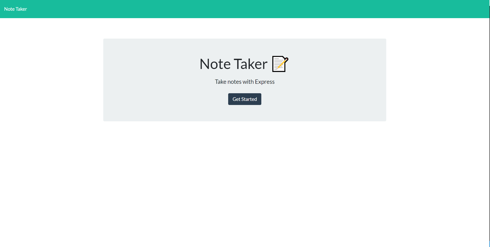
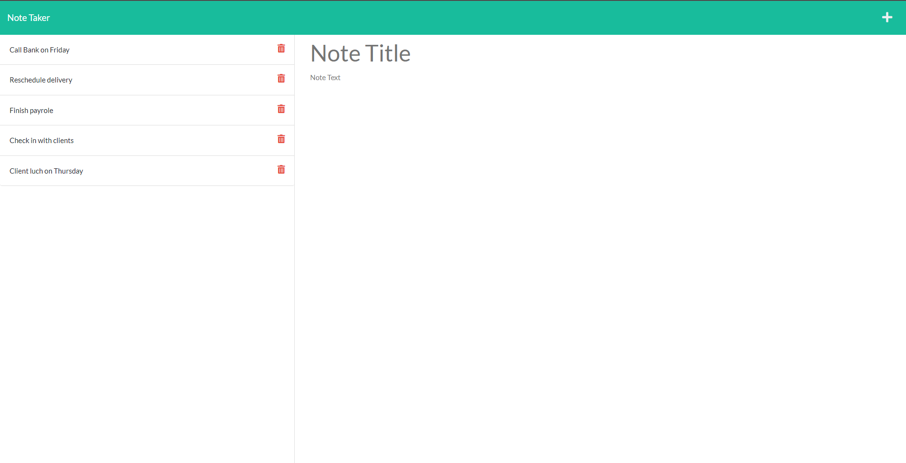
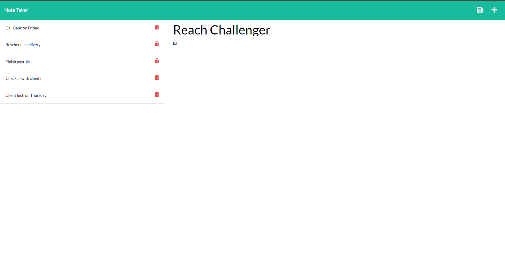
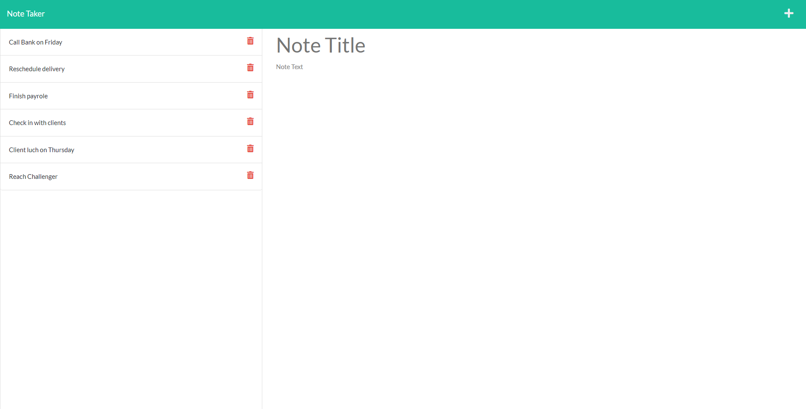

# Note Taker Starter Code

## Table of Contents
[Description](#description) 
[Links](#links) 
[Technology's Used](#technologys-used) 
[ScreenShots](#screenshots)

## Description
User are taken to a landing page for a note taking app. 
If the user presses on the 'get started' button they are presented with the note taking interface. 
User need to enter a note title and note text before they are able to save their note. 
User can press on existing note and it will pop up on to the right

## Links
Link to Deployed Heroku page: <a href="https://ancient-woodland-90728.herokuapp.com/">Note App</a> 
Link to Github Repo: <a href="https://github.com/AlexUrielContreras/note-app">GitHub Repo</a>

## Technology's Used
<ul>
    <li>HTML</li>
    <li>CSS</li>
    <li>JavaScript</li>
</ul>

## ScreenShots
 
 
 
 